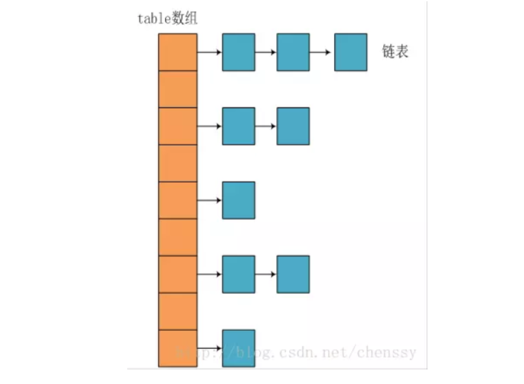
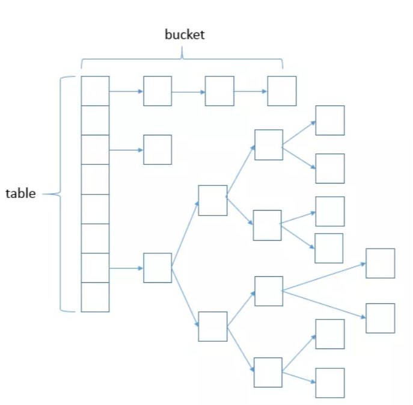

# Map


### HashMap 概述

　　Map 是 Key-Value 对映射的抽象接口，该映射不包括重复的键，即一个键对应一个值。HashMap 是 Java Collection Framework 的重要成员，也是Map族(如下图所示)中我们最为常用的一种。简单地说，HashMap 是基于哈希表的 Map 接口的实现，以 Key-Value 的形式存在，即存储的对象是 Entry (同时包含了 Key 和 Value) 。在HashMap中，其会根据hash算法来计算key-value的存储位置并进行快速存取。特别地，**HashMap最多只允许一条Entry的键为Null(多条会覆盖)，但允许多条Entry的值为Null。**此外，HashMap 是 Map 的一个**非同步**的实现。 


​	　	

### HashMap内部结构

需要了解hash算法的基本知识

#### JDK1.8之前：

JDK1.8之前HashMap底层是数组和链表结合在一起使用也就是链表散列。HashMap通过key的hashCode来计算hash值，当hashCode相同时，通过“拉链法”解决冲突。

所谓“拉链法”就是：将链表和数组相结合。也就是说创建一个链表数组，数组中每一格就是一个链表。若遇到哈希冲突，则将冲突的值加到链表中即可。

 



简单来说，JDK1.8之前HashMap由数组+链表组成的，数组是HashMap的主体，链表则是主要为了解决哈希冲突而存在的，如果定位到的数组位置不含链表（当前entry的next指向null）,那么对于查找，添加等操作很快，仅需一次寻址即可；如果定位到的数组包含链表，对于添加操作，其时间复杂度依然为O(1)，因为最新的Entry会插入链表头部，急需要简单改变引用链即可，而对于查找操作来讲，此时就需要遍历链表，然后通过key对象的equals方法逐一比对查找.


#### JDK1.8之后：

相比于之前的版本，jdk1.8在解决哈希冲突时有了较大的变化，当链表长度大于阈值（默认为8）时，将链表转化为红黑树，以减少搜索时间。


 


```java
public class HashMap<K,V> extends AbstractMap<K,V> implements Map<K,V>, Cloneable, Serializable {
    // 序列号
    private static final long serialVersionUID = 362498820763181265L;    
    // 默认的初始容量是16
    static final int DEFAULT_INITIAL_CAPACITY = 1 << 4;   
    // 最大容量
    static final int MAXIMUM_CAPACITY = 1 << 30; 
    // 默认的填充因子
    static final float DEFAULT_LOAD_FACTOR = 0.75f;
    // 当桶(bucket)上的结点数大于这个值时会转成红黑树
    static final int TREEIFY_THRESHOLD = 8; 
    // 当桶(bucket)上的结点数小于这个值时树转链表
    static final int UNTREEIFY_THRESHOLD = 6;
    // 桶中结构转化为红黑树对应的table的最小大小
    static final int MIN_TREEIFY_CAPACITY = 64;
    // 存储元素的数组，总是2的幂次倍
    transient Node<k,v>[] table; 
    // 存放具体元素的集
    transient Set<map.entry<k,v>> entrySet;
    // 存放元素的个数，注意这个不等于数组的长度。
    transient int size;
    // 每次扩容和更改map结构的计数器
    transient int modCount;   
    // 临界值 当实际大小(容量*填充因子)超过临界值时，会进行扩容
    int threshold;
    // 填充因子
    final float loadFactor;
}
```

### 构造函数


```java
/**
     * Constructs an empty <tt>HashMap</tt> with the default initial capacity
     * (16) and the default load factor (0.75).
     */
public HashMap() {
  //DEFAULT_LOAD_FACTOR(负载因子)  默认0.75
    this.loadFactor = DEFAULT_LOAD_FACTOR; // all other fields defaulted
}
```

　 

(1)loadFactor加载因子

loadFactor加载因子是控制数组存放数据的疏密程度，loadFactor越趋近于1，那么   数组中存放的数据(entry)也就越多，也就越密，也就是会让链表的长度增加，loadFactor越小，也就是趋近于0，就越稀疏。

**loadFactor太大导致查找元素效率低，太小导致数组的空间利用率低，存放的数据会很分散。loadFactor的默认值为0.75f是官方给出的一个比较好的临界值**。  

(2)threshold

**threshold = capacity \* loadFactor**，**当Size>=threshold**的时候，那么就要考虑对数组的扩增了，也就是说，这个的意思就是 **衡量数组是否需要扩增的一个标准**。


**Node节点类源码:**

```java
// 继承自 Map.Entry<K,V>
static class Node<K,V> implements Map.Entry<K,V> {
       final int hash;// 哈希值，存放元素到hashmap中时用来与其他元素hash值比较
       final K key;//键
       V value;//值
       // 指向下一个节点
       Node<K,V> next;
       Node(int hash, K key, V value, Node<K,V> next) {
            this.hash = hash;
            this.key = key;
            this.value = value;
            this.next = next;
        }
        public final K getKey()        { return key; }
        public final V getValue()      { return value; }
        public final String toString() { return key + "=" + value; }
        // 重写hashCode()方法
        public final int hashCode() {
            return Objects.hashCode(key) ^ Objects.hashCode(value);
        }

        public final V setValue(V newValue) {
            V oldValue = value;
            value = newValue;
            return oldValue;
        }
        // 重写 equals() 方法
        public final boolean equals(Object o) {
            if (o == this)
                return true;
            if (o instanceof Map.Entry) {
                Map.Entry<?,?> e = (Map.Entry<?,?>)o;
                if (Objects.equals(key, e.getKey()) &&
                    Objects.equals(value, e.getValue()))
                    return true;
            }
            return false;
        }
}
 
```

**树节点类源码:**

```java
static final class TreeNode<K,V> extends LinkedHashMap.Entry<K,V> {
        TreeNode<K,V> parent;  // 父
        TreeNode<K,V> left;    // 左
        TreeNode<K,V> right;   // 右
        TreeNode<K,V> prev;    // needed to unlink next upon deletion
        boolean red;           // 判断颜色
        TreeNode(int hash, K key, V val, Node<K,V> next) {
            super(hash, key, val, next);
        }
        // 返回根节点
        final TreeNode<K,V> root() {
            for (TreeNode<K,V> r = this, p;;) {
                if ((p = r.parent) == null)
                    return r;
                r = p;
       }
```


 

 

### PUT函数


```java
   /**
     * Associates the specified value with the specified key in this map.
     * If the map previously contained a mapping for the key, the old
     * value is replaced.
   	   //创建一个特殊的key-value，如果已经包含当前Key 则覆盖Old key的value
   	   
     *
     * @param key key with which the specified value is to be associated
     * @param value value to be associated with the specified key
     * @return the previous value associated with <tt>key</tt>, or
     *         <tt>null</tt> if there was no mapping for <tt>key</tt>.
     *         (A <tt>null</tt> return can also indicate that the map
     *         previously associated <tt>null</tt> with <tt>key</tt>.)
     */
		//	如果以前包含此key则返回oldkey的value 如果没有return null
		 //参数false：改变已经存在的值的Value   也就是覆盖相同key的key-value
			//参数true：该表处于创建模式。
   public V put(K key, V value) {
    return putVal(hash(key), key, value, false, true);
}
```

```java
//hash函数 计算key的hash值
static final int hash(Object key) {
    int h;			//key可以等于null   null的话hash值为0 当然也是不能重复
    //key.hashCode()为key键值类型自带的哈希函数 32位，返回初始哈希值
    //		h右移16位  原始h的高16位变为0低16位变成高16位的值  ^（异或运算符）
    //		原始h和右移16位h异或   叫做扰动函数  目的 ： 降低碰撞率
    return (key == null) ? 0 : (h = key.hashCode()) ^ (h >>> 16);
}
```

​		**得出的hash值  后续还会取模数组长度 才会成为数组下标**

​	 hash=hash%（table.lenth-1）   ==》    hash=hash&（table.lenth-1）    

​		按位于取模运算比取模运算有效率   而且当前情况适用 ：因为数组长度总数2的次方

​		如16  为 10000   减一     =   01111      按位于刚好是取模

   	**如果高位不同低位相同   数组下标值就会一样  就会碰撞**  

​		**故：做出上面的高16位移到低16位再异或   降低碰撞率**


```java
/**
 * Implements Map.put and related methods
 *
 * @param hash hash for key
 * @param key the key
 * @param value the value to put
 * @param onlyIfAbsent if true, don't change existing value
 * @param evict if false, the table is in creation mode.
 * @return previous value, or null if none
 */
final V putVal(int hash, K key, V value, boolean onlyIfAbsent,
               boolean evict) {
  	//新建Node数组 tab  Node节点 p
    Node<K,V>[] tab; Node<K,V> p; int n, i;
  
  	// table引用赋值给tab  如果是null或者长度为0   也就是数组还没初始化和添加元素
  	//	就执行 resize()函数  并且把扩大的数组大小赋值给n
 	/**resize函数： 初始化或加倍表格大小。 如果为null，则根据字段阈值中保存的初始容量目标进行分配。 否则，因为我们正在使用二次幂扩展，所以每个bin中的元素必须保持相同的索引，或者在新表中以两个偏移的幂移动。**/
    
    if ((tab = table) == null || (n = tab.length) == 0)
        n = (tab = resize()).length;
    //通过hash算法计算出的数组下标没有元素  说明元素不重复而且hash没有碰撞 则添加
    if ((p = tab[i = (n - 1) & hash]) == null)
        tab[i] = newNode(hash, key, value, null);
    		//else里面的则是数组下标冲突  两种情况：1、元素重复 2、单纯下标碰撞
    else {
        Node<K,V> e; K k;
        //链表首元素就发生了元素重复  把p也就是旧元素的值 赋值给e  不break  下面判断函数中会执行覆盖操作 并且末尾会return  旧元素的值
        if (p.hash == hash &&
            ((k = p.key) == key || (key != null && key.equals(k))))
            e = p;
        //数组中元素个数超过TREEIFY_THRESHOLD  链表会装换成二叉树
        //也就是元素少的时候  冲突解决办法用链表冲突元素向后链接   多则二叉树
        //如果当前已经是二叉树后 而且当前元素不重复   旧元素赋值给e  后面代码会执行覆盖操作
        else if (p instanceof TreeNode)
            e = ((TreeNode<K,V>)p).putTreeVal(this, tab, hash, key, value);
        //冲突元素添加区域还是链表 
        else {
            //便利链表
            for (int binCount = 0; ; ++binCount) {
                //如果到遍历最后一个 说明不重复 就添加进去
                if ((e = p.next) == null) {
                		//添加进链表
                    p.next = newNode(hash, key, value, null);
    //元素数量已经达到TREEIFY_THRESHOLD值（-1是因为上面刚添加一个元素没算）  需要转换成二叉树
                    if (binCount >= TREEIFY_THRESHOLD - 1) // -1 for 1st
                        treeifyBin(tab, hash);
                    break;
                }
                //如果和链表中元素重复则  旧元素赋值给e  后面代码会执行覆盖操作
                if (e.hash == hash &&
                    ((k = e.key) == key || (key != null && key.equals(k))))
                    break;
                p = e;
            }
        }
        //上面写的覆盖操作在这里  
        if (e != null) { // existing mapping for key
            V oldValue = e.value;
            if (!onlyIfAbsent || oldValue == null)
                e.value = value;
            afterNodeAccess(e);
            return oldValue;
        }
    }
    //修改次数加一
    ++modCount;
    //数组大小加一 并且判断是否需要扩容
    if (++size > threshold)
        resize(); 
    afterNodeInsertion(evict);
    return null;
}
```

```java
//允许LinkedHashMap后期操作的回调   应该是LinkedHashMap中的操作  我也母鸡
// Callbacks to allow LinkedHashMap post-actions
void afterNodeAccess(Node<K,V> p) { }
void afterNodeInsertion(boolean evict) { }
void afterNodeRemoval(Node<K,V> p) { }
```

#### PUT总结

- 判断当前数组是否为空

-   hash算法及取模算出下标

  - 下标不冲突 添加元素

  - 下标冲突

    - 依次遍历冲突域 

      - 如果有相同元素覆盖

        

      - 没有相同元素遍历到结尾添加

        - 如果当前是链表添加后到达阈值  则转换成二叉树

- 如果元素覆盖则返回旧元素
- 修改次数++      大小++    判断是否需要扩容


### get方法

```java
public V get(Object key) {
    Node<K,V> e;
    return (e = getNode(hash(key), key)) == null ? null : e.value;
}
 /**
     * Implements Map.get and related methods
     *
     * @param hash hash for key
     * @param key the key
     * @return the node, or null if none
     */
final Node<K,V> getNode(int hash, Object key) {
    Node<K,V>[] tab; Node<K,V> first, e; int n; K k;
    	//数组不空  长度大于0  hash算法再取模查找到的下标在数组中存在
    if ((tab = table) != null && (n = tab.length) > 0 &&
        (first = tab[(n - 1) & hash]) != null) {
        // 数组元素相等  
        if (first.hash == hash && // always check first node
            ((k = first.key) == key || (key != null && key.equals(k))))
            return first;
        // 桶中不止一个节点
        if ((e = first.next) != null) {
            // 在树中get   
            if (first instanceof TreeNode)
                return ((TreeNode<K,V>)first).getTreeNode(hash, key);
            // 在链表中get
            do {
                if (e.hash == hash &&
                    ((k = e.key) == key || (key != null && key.equals(k))))
                    return e;
            } while ((e = e.next) != null);
        }
    }
    return null;
}
```

#### Get总结

- 计算hash值并取模得出数组下标
- 在数组下标元素判断是否相等
  	- 相等就return元素
  	- 不相等遍历碰撞域   如果有相等就return元素   （如果有碰撞域）

- 如果最终没有相等的元素则返回null


### resize扩容函数

```java
   /**
     * Initializes or doubles table size.  If null, allocates in
     * accord with initial capacity target held in field threshold.
     * Otherwise, because we are using power-of-two expansion, the
     * elements from each bin must either stay at same index, or move
     * with a power of two offset in the new table.
     *
     * @return the table
     */
    final Node<K,V>[] resize() {
        Node<K,V>[] oldTab = table;
        int oldCap = (oldTab == null) ? 0 : oldTab.length;
        int oldThr = threshold;
        int newCap, newThr = 0;
        if (oldCap > 0) {
            //已经到达最大容量 无法扩容了    随你碰撞去吧  
            if (oldCap >= MAXIMUM_CAPACITY) {
                threshold = Integer.MAX_VALUE;
                return oldTab;
            }    //扩容2倍
            else if ((newCap = oldCap << 1) < MAXIMUM_CAPACITY &&
                     oldCap >= DEFAULT_INITIAL_CAPACITY)
                newThr = oldThr << 1; // double threshold
        }
 // 这里是指, 如果构造时指定了initialCapacity, 则用threshold作为table的实际大小
        else if (oldThr > 0) // initial capacity was placed in threshold
            newCap = oldThr;
        //数组啥都还没初始化   数组初始化容量16  threshold = 16*0.75
        else {               // zero initial threshold signifies using defaults
            newCap = DEFAULT_INITIAL_CAPACITY;
            newThr = (int)(DEFAULT_LOAD_FACTOR * DEFAULT_INITIAL_CAPACITY);
        }
        if (newThr == 0) {
            float ft = (float)newCap * loadFactor;
            newThr = (newCap < MAXIMUM_CAPACITY && ft < (float)MAXIMUM_CAPACITY ?
                      (int)ft : Integer.MAX_VALUE);
        }
        threshold = newThr;
        @SuppressWarnings({"rawtypes","unchecked"})
        //创建新数组
            Node<K,V>[] newTab = (Node<K,V>[])new Node[newCap];
       // map数组引用指向新数组
        table = newTab;
        //开始转移数据
        if (oldTab != null) {
            //遍历原数组每一个元素
            for (int j = 0; j < oldCap; ++j) {
                Node<K,V> e;
                //不为空的都转移
                if ((e = oldTab[j]) != null) {
                    //释放原数组引用 等待垃圾回收
                    oldTab[j] = null;
                    //原数组当前位置 只有一个元素  无冲突碰撞元素
                    if (e.next == null)
                        newTab[e.hash & (newCap - 1)] = e;
                    //含有碰撞元素 而且当前碰撞元素在二叉树中
                    else if (e instanceof TreeNode)
                        ((TreeNode<K,V>)e).split(this, newTab, j, oldCap);
                    else { // preserve order
                        Node<K,V> loHead = null, loTail = null;
                        Node<K,V> hiHead = null, hiTail = null;
                        Node<K,V> next;
                        do {
                            next = e.next;
//如原数组大小16        当前元素在元素组下标为hash&15   =abcd   15 ： 01111
//新数组大小肯定是32	当前元素在新数组下标为hash&31   =Xabcd   31： 011111
                       //hash&16   =X      				16：    10000
                            //如果X=0说明在新数组中下标相同   用lo链表区别
                            if ((e.hash & oldCap) == 0) {
                                if (loTail == null)
                                    loHead = e;
                                else
                                    loTail.next = e;
                                loTail = e;
                            }
                        //如果X！=0说明在新数组中下标需要+oldcap 用hi链表区别
                            else {
                                if (hiTail == null)
                                    hiHead = e;
                                else
                                    hiTail.next = e;
                                hiTail = e;
                            }
                        } while ((e = next) != null);
                      	//当前元素在新旧数组中下标一样  直接移植
                        if (loTail != null) {
                            loTail.next = null;
                            newTab[j] = loHead;
                        }
                   //当前元素在新旧数组中下标不同  多一个高一位X 也就是旧数组大小
                        if (hiTail != null) {
                            hiTail.next = null;
                            newTab[j + oldCap] = hiHead;
                        }
                    }
                }
            }
        }
        
        return newTab;
    }
```

#### Rezize函数总结

- 扩容就是创建新数组并转移数据    或者是数组初始化
- 转移数据时特别注意  
  - 部分元素新旧数组下标计算一样   直接转移
  - 部分元素新旧数组下标计算不一致   转移需进行相应操作


**（后面源码暂时未分析）**

###  putTreeVal函数（碰撞元素添加进二叉树）


```java
    /**
         * Tree version of putVal.
         */
final TreeNode<K,V> putTreeVal(HashMap<K,V> map, Node<K,V>[] tab,
                                       int h, K k, V v) {
            Class<?> kc = null;
            boolean searched = false;
            TreeNode<K,V> root = (parent != null) ? root() : this;
            for (TreeNode<K,V> p = root;;) {
                int dir, ph; K pk;
                if ((ph = p.hash) > h)
                    dir = -1;
                else if (ph < h)
                    dir = 1;
                else if ((pk = p.key) == k || (k != null && k.equals(pk)))
                    return p;
                else if ((kc == null &&
                          (kc = comparableClassFor(k)) == null) ||
                         (dir = compareComparables(kc, k, pk)) == 0) {
                    if (!searched) {
                        TreeNode<K,V> q, ch;
                        searched = true;
                        if (((ch = p.left) != null &&
                             (q = ch.find(h, k, kc)) != null) ||
                            ((ch = p.right) != null &&
                             (q = ch.find(h, k, kc)) != null))
                            return q;
                    }
                    dir = tieBreakOrder(k, pk);
                }

                TreeNode<K,V> xp = p;
                if ((p = (dir <= 0) ? p.left : p.right) == null) {
                    Node<K,V> xpn = xp.next;
                    TreeNode<K,V> x = map.newTreeNode(h, k, v, xpn);
                    if (dir <= 0)
                        xp.left = x;
                    else
                        xp.right = x;
                    xp.next = x;
                    x.parent = x.prev = xp;
                    if (xpn != null)
                        ((TreeNode<K,V>)xpn).prev = x;
                    moveRootToFront(tab, balanceInsertion(root, x));
                    return null;
                }
            }
        }
```

### treeifyBin函数（链表转换二叉树）

```java
 /**
     * Replaces all linked nodes in bin at index for given hash unless
     * table is too small, in which case resizes instead.
     */
    final void treeifyBin(Node<K,V>[] tab, int hash) {
        int n, index; Node<K,V> e;
        if (tab == null || (n = tab.length) < MIN_TREEIFY_CAPACITY)
            resize();
        else if ((e = tab[index = (n - 1) & hash]) != null) {
            TreeNode<K,V> hd = null, tl = null;
            do {
                TreeNode<K,V> p = replacementTreeNode(e, null);
                if (tl == null)
                    hd = p;
                else {
                    p.prev = tl;
                    tl.next = p;
                }
                tl = p;
            } while ((e = e.next) != null);
            if ((tab[index] = hd) != null)
                hd.treeify(tab);
        }
    }
```

 


### HashMap常用方法测试

```
package map;

import java.util.Collection;
import java.util.HashMap;
import java.util.Set;

public class HashMapDemo {

	public static void main(String[] args) {
		HashMap<String, String> map = new HashMap<String, String>();
		// 键不能重复，值可以重复
		map.put("san", "张三");
		map.put("si", "李四");
		map.put("wu", "王五");
		map.put("wang", "老王");
		map.put("wang", "老王2");// 老王被覆盖
		map.put("lao", "老王");
		System.out.println("-------直接输出hashmap:-------");
		System.out.println(map);
		/**
		 * 遍历HashMap
		 */
		// 1.获取Map中的所有键
		System.out.println("-------foreach获取Map中所有的键:------");
		Set<String> keys = map.keySet();
		for (String key : keys) {
			System.out.print(key+"  ");
		}
		System.out.println();//换行
		// 2.获取Map中所有值
		System.out.println("-------foreach获取Map中所有的值:------");
		Collection<String> values = map.values();
		for (String value : values) {
			System.out.print(value+"  ");
		}
		System.out.println();//换行
		// 3.得到key的值的同时得到key所对应的值
		System.out.println("-------得到key的值的同时得到key所对应的值:-------");
		Set<String> keys2 = map.keySet();
		for (String key : keys2) {
			System.out.print(key + "：" + map.get(key)+"   ");

		}
		/**
		 * 另外一种不常用的遍历方式
		 */
		// 当我调用put(key,value)方法的时候，首先会把key和value封装到
		// Entry这个静态内部类对象中，把Entry对象再添加到数组中，所以我们想获取
		// map中的所有键值对，我们只要获取数组中的所有Entry对象，接下来
		// 调用Entry对象中的getKey()和getValue()方法就能获取键值对了
		Set<java.util.Map.Entry<String, String>> entrys = map.entrySet();
		for (java.util.Map.Entry<String, String> entry : entrys) {
			System.out.println(entry.getKey() + "--" + entry.getValue());
		}
		
		/**
		 * HashMap其他常用方法
		 */
		System.out.println("after map.size()："+map.size());
		System.out.println("after map.isEmpty()："+map.isEmpty());
		System.out.println(map.remove("san"));
		System.out.println("after map.remove()："+map);
		System.out.println("after map.get(si)："+map.get("si"));
		System.out.println("after map.containsKey(si)："+map.containsKey("si"));
		System.out.println("after containsValue(李四)："+map.containsValue("李四"));
		System.out.println(map.replace("si", "李四2"));
		System.out.println("after map.replace(si, 李四2):"+map);
	}

}
```

 